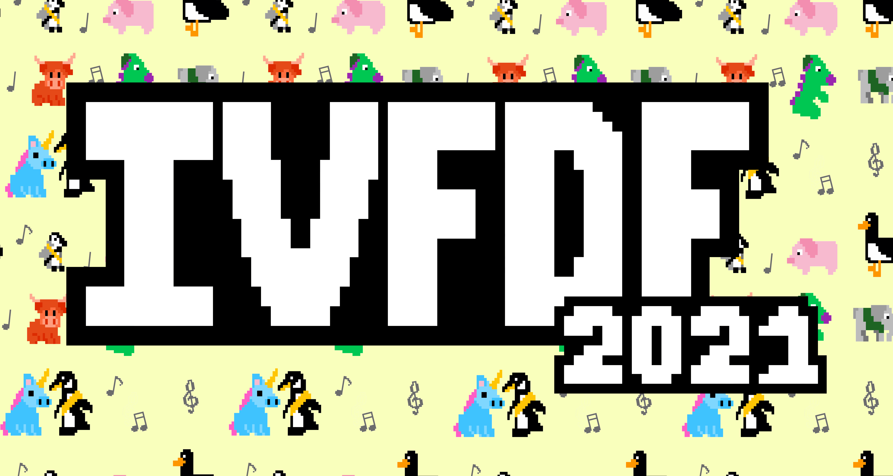

---
# Feel free to add content and custom Front Matter to this file.
# To modify the layout, see https://jekyllrb.com/docs/themes/#overriding-theme-defaults

layout: home
list_title: News
---

Welcome to IVFDF 2021! This year your hosts are the [Bristol University Folk Society](https://bristolfolksoc.com/) and for obvious reasons, we’re trying out a new format and bringing you an online festival weekend. 
Join us throughout the weekend of **Feb 19th-21st** when we’ll have lots of exciting music and activities for you to enjoy. 
We hope to bring you some of the amazing IVFDF spirit we love.  

On the Friday and Sat evenings we have some fab musicians and callers lined up to give you the full folky experience.
We’ll have some ceilidh, balfolk, contra, playford and Scottish for you to enjoy. 
Plus there’ll be all your IVFDF favourites: workshops, sessions, display ceilidh, and a survivors ceilidh to finish. 

All our profits will be split between our performers.
We’re hoping to provide some much needed income in this difficult time for the folk music world. 

Buy your weekend ticket **[now]({{site.baseurl}}/tickets/)** or donate a little extra if you can offer some extra support. 

The IVFDF community is a big part of what makes the festival so special. 
We hope you’ll take part in our [community spaces and events]({{site.baseurl}}/community/). 
We’ll have a dedicated Discord server and Minecraft world available throughout the weekend for ticket holders to socialise in.
